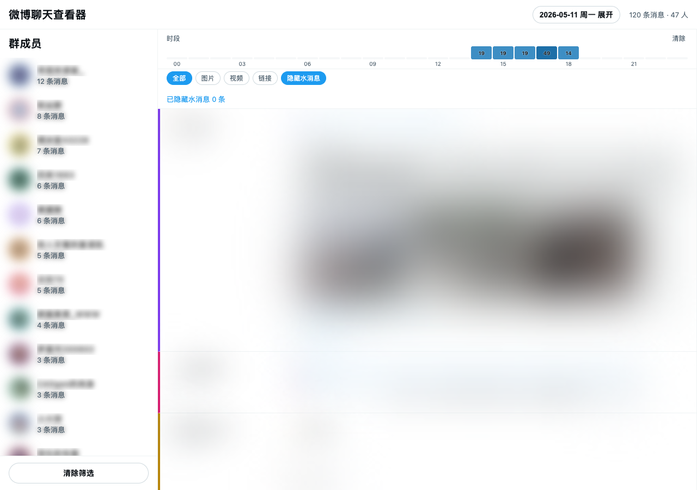

# Weibo Group Chat Archiver

自动抓取微博网页聊天群的历史消息，支持定时运行、按天导出和本地可视化查看。

## 预览



## 功能

- 自动登录（Cookie 保持）
- 通过 API 分页加载所有历史消息
- 按日期分组导出为 JSON
- 支持定时任务（macOS launchd）
- 支持无头模式（后台运行）
- 本地 Web 查看器（支持日历、时段热力图、用户筛选、媒体类型筛选）
- 自动提取图片（通过 fids），分享卡片图片通过代理绕过防盗链
- 微博分享卡片展示（标题、作者、图片、转评赞）
- 视频链接和附件 URL 展示
- 转发引用区块高亮显示
- 用户头像显示
- Emoji 渲染为 Unicode

## 安装

```bash
git clone https://github.com/YOUR_USERNAME/weibo-chat-auto.git
cd weibo-chat-auto
npm install
```

## 使用步骤

### 1. 首次使用：保存 Cookie

```bash
npm run save-cookies
```

浏览器会打开微博登录页面，登录后 Cookie 自动保存到 `cookies.json`。

### 2. 配置目标群聊

编辑 `auto-archive-simple.js`，将 `groupName` 改为你要归档的群名称（必须与微博聊天中的群名完全一致）：

```javascript
const CONFIG = {
    groupName: '你的群名称',  // 例如 '家人群'、'公司群'
};
```

### 3. 运行归档

```bash
npm run archive
```

首次运行会拉取最近 7 天的消息，之后每次从上次截止时间继续。

### 4. 查看归档数据

```bash
npm run view
```

打开 http://localhost:3456 查看消息。

### 5. 定时自动运行（可选）

```bash
# 编辑 plist 中的路径，然后：
launchctl load com.allo.weibo-chat-archive.plist

# 查看状态
launchctl list | grep weibo

# 停用
launchctl unload com.allo.weibo-chat-archive.plist
```

## 项目结构

```
├── auto-archive-simple.js   # 主归档脚本
├── save-cookies.js          # Cookie 保存工具
├── viewer-server.js         # 本地查看器服务器
├── viewer.html              # 查看器页面
├── cookies.json             # 登录凭据（不提交）
├── cookies.json.example     # Cookie 模板
├── output/                  # 归档数据（不提交）
│   ├── weibo_chat_2026-05-01.json
│   └── ...
├── com.allo.weibo-chat-archive.plist  # macOS 定时任务配置
└── package.json
```

## 配置

编辑 `auto-archive-simple.js` 中的 `CONFIG`：

```javascript
const CONFIG = {
    chatUrl: 'https://api.weibo.com/chat#/chat',
    outputDir: path.join(__dirname, 'output'),
    chromePath: '/Applications/Google Chrome.app/Contents/MacOS/Google Chrome',
    cookieFile: path.join(__dirname, 'cookies.json'),
    stateFile: path.join(__dirname, 'last-archive-state.json'),
    groupName: '你的群名称',
};
```

## 输出数据格式

每条消息包含：

```json
{
    "id": 123456789,
    "from_uid": 12345,
    "user": "用户名",
    "avatar": "https://...",
    "timestamp": 1778000000000,
    "time": "2026/05/11 12:00:00",
    "date": "2026-05-11",
    "content": "消息内容",
    "type": 321,
    "pics": ["https://upload.api.weibo.com/2/mss/msget?source=209678993&fid=..."],
    "share": {
        "url": "http://weibo.com/...",
        "title": "...",
        "author": "...",
        "pics": ["https://wx1.sinaimg.cn/large/..."],
        "reposts": 100,
        "comments": 50,
        "likes": 200
    }
}
```

## 故障排除

### Cookie 失效

重新运行 `npm run save-cookies`

### 页面加载失败

检查 Chrome 路径是否正确，确保已安装 Google Chrome

### 图片不显示

图片通过本地服务器代理加载（需要有效的 Cookie），Cookie 过期后图片无法显示

## 隐私声明

**本工具仅供归档自己参与的群聊消息，请勿用于侵犯他人隐私。**

- 归档的数据包含群内所有成员的消息内容、用户名和头像
- 请妥善保管 `cookies.json` 和 `output/` 目录，不要公开分享
- 本项目代码仅供学习交流，使用者需自行承担风险
- 请遵守微博服务条款和相关法律法规

## License

MIT
